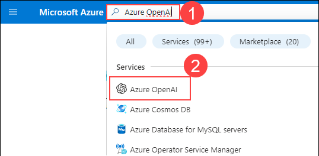

# Exercise 1: Embedding Creation

## Task 1: Deploy Azure OpenAI and Models

Azure OpenAI offers a web-based portal called **Azure OpenAI Studio** for deploying, managing, and exploring models. Follow these steps to deploy a model using Azure OpenAI Studio:

#### Deploy Azure OpenAI Resource

1. In the Azure portal, type **Azure OpenAI (1)** in the search box and select **Azure OpenAI (2)** from the results.

    

1. On **Azure AI services | Azure OpenAI** blade, click on **+ Create**.

    .png)

1. On the **Create Azure OpenAI** resource page, enter the following settings and click on **Next (6)** button.
   
    - **Subscription (1)**: Default - Pre-assigned subscription.
    
    - **Resource group (2)**: Select openai-embedded-<inject key="Deployment ID" enableCopy="false"></inject>
    
    - **Region (3)**: Select **<inject key="Region" enableCopy="false" />**
    
    - **Name (4)**: Openai-<inject key="Deployment ID" enableCopy="false"></inject>
    
    - **Pricing tier (5)**: Standard S0

      .png)

1. On the **Network** page, leave the value as default and click on **Next** button.

    .png)

1. On the **Tags** page, leave the value as default and click **Next** button.

    .png)
  
1. On the **Review + submit** page, review the configuration, and click on **Create** button.

    .png)

1. Once the deployment is complete, click on **Go to resource**.    

    .png)

#### Deploy Models in Azure OpenAI Studio

1. On the Azure OpenAI overview page, click **Go to Azure OpenAI Studio** to navigate to Azure AI Studio.

    .png)

1. On the Welcome to Azure OpenAI service page, click on **Create new deployment**.

    .png)

1. On the Deployments page, click on **+ Create new deployment**.

    .png)    

1. In the Deploy model pop-up, enter the following details and click on **Create (4)** button.
    
    - **Deployment name (1)**: text-davinci-003

    - **Select a model (2)**: gpt-35-turbo-instruct
    
    - **Tokens per Minute Rate Limit (thousands) (3)**: 40K

      .png)

1. Repeat the process to create another deployment with the following details and click on **Create (4)** button. 

    - **Deployment name (1)**: text-embedding-ada-002

    - **Select a model (2)**: text-embedding-ada-002
    
    - **Tokens per Minute Rate Limit (thousands) (3)**: 40K

      .png)

## Task 2: Create Azure AI Search Resources

#### Create AI Search Service

1. In the Azure portal, type **AI Search (1)** in the search box and select **AI Search (2)** from the results.

1. On the **Azure AI services | AI Search** blade, click **Create**.

   
1. Create a **search service** resource with the following settings:
   
    - **Subscription**: Default - Pre-assigned subscription
    
    - **Resource group**: Select openai-embedded-<inject key="Deployment ID" enableCopy="false"></inject>
    
    - **Region**: Select <inject key="Region" enableCopy="false" />
    
    - **Name**: Aisearch-<inject key="Deployment ID" enableCopy="false"></inject>
    
    - **Pricing tier**: Standard

1. Click **Review + Create** and then **Create**.
     

1. Once the deployment is complete, click **Go To Resources**.

1. On the overview page of the AI Search Search Service, copy the **URL** and store it in a notepad for future use.

1. In the AI Search blade, click on **Keys** under Settings, copy the Primary admin key, and store it in a notepad for future use.

    
#### Create Document Intelligence Resource

1. In the Azure portal, type **Document intelligence (1)** in the search box and select **Document intelligence (2)** from the results.

1. On the **Azure AI services | Document intelligence** blade, click **Create**.

    

1. Create a **Document intelligence** resource with the following settings:
   
    - **Subscription**: Default - Pre-assigned subscription.
    
    - **Resource group**: Select openai-embedded-<inject key="Deployment ID" enableCopy="false"></inject>
    
    - **Region**: Select <inject key="Region" enableCopy="false" />
    
    - **Name**: Document-intelligence-<inject key="Deployment ID" enableCopy="false"></inject>
    
    - **Pricing tier**: Standard S0
    
    
1. Click **Review + Create** and then **Create**.

1. Once the deployment is complete, click **Go To Resources**.

1. In the Document intelligence resource, select **Key & Endpoint** from the left menu, click **Show Keys**, copy **KEY 1** and the **Endpoint**, and store them in a notepad for later use.

#### Create Translator Resource

1. In the Azure portal, type **Translator (1)** in the search box and select **Translator (2)** from the results.

1. On the **Azure AI services | Translator** blade, click **Create**.

    

1. Create a **Translator** resource with the following settings:
   
    - **Subscription**: Default - Pre-assigned subscription.
    
    - **Resource group**: openai-embedded-<inject key="Deployment ID" enableCopy="false"></inject>
    
    - **Region**: Select <inject key="Region" enableCopy="false" />
    
    - **Name**: Translator-<inject key="Deployment ID" enableCopy="false"></inject>
    
    - **Pricing tier**: Standard S1
    
    
4. Click **Review + Create** and then **Create**.

5. Once the deployment is complete, click **Go To Resources**.

6. In the Translator resource, select **Key & Endpoint** from the left menu, click **Show Keys**, copy **KEY 1** and the **Endpoint**, and store them in a notepad for later use.

## Task 3: Deploy Azure function with embeddings

1. 