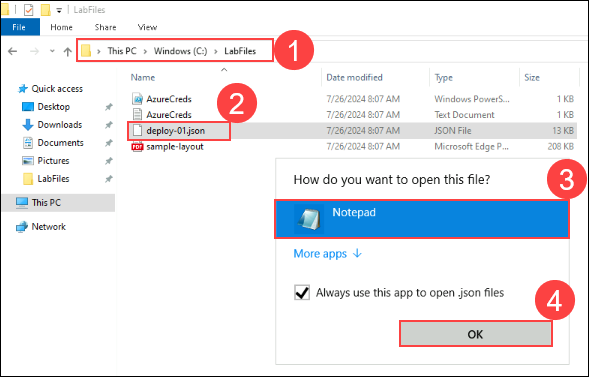
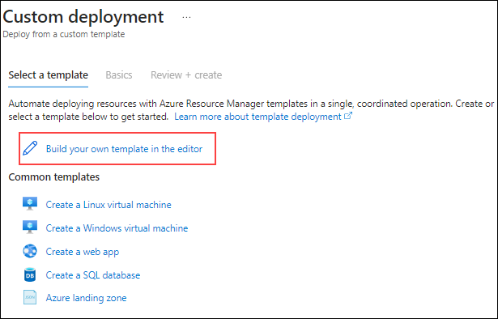
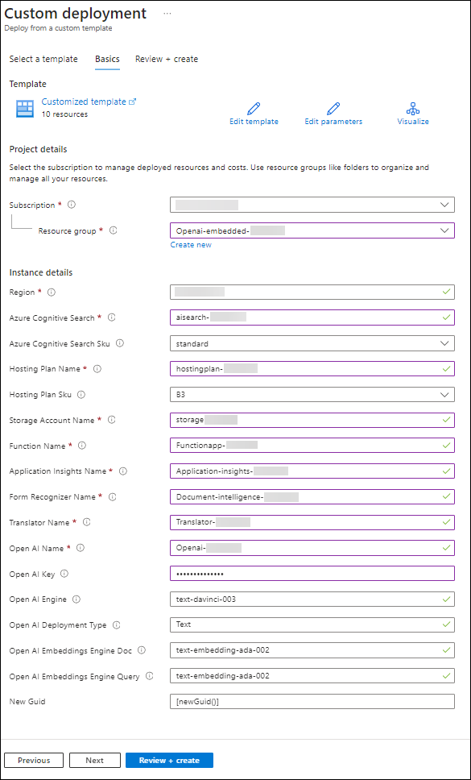
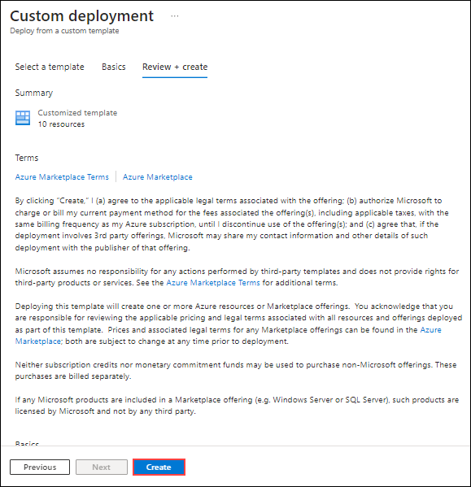

# Exercise 1: Embedding Creation

## Estimated time: 60 minutes

In this exercise, you will gain hands-on experience in setting up a comprehensive Azure-based environment for embedding creation and document processing. The exercise is structured into two main parts:

- **Configuring Azure Resources:** You will deploy and configure essential Azure services, including Azure OpenAI, Azure AI Search (Formerly known as: Cognitive Search), Document Intelligence (Formerly know as: Form Recognizer), and Translator. These resources are critical for the effective generation and management of document embeddings.

- **Deploying Azure Functions:** You will implement Azure Functions to automate and optimize the document processing pipeline. This involves configuring functions to handle document extraction, translation, embedding generation, and query processing.

## Lab objectives
In this lab, you will complete the following tasks:

- Task 1: Deploy Azure OpenAI and Models
- Task 2: Create Azure AI Search Resources
- Task 3: Deploy Azure Function with Embeddings

## Task 1: Deploy Azure OpenAI and Models

In this task, You will begin by deploying an Azure OpenAI resource through the Azure portal. This involves creating an OpenAI resource, configuring it with the appropriate settings, and deploying models such as **text-davinci-003** and **text-embedding-ada-002** using Azure OpenAI Studio.

Azure OpenAI offers a web-based portal called **Azure OpenAI Studio** for deploying, managing, and exploring models. Follow these steps to deploy a model using Azure OpenAI Studio:

### Deploy Azure OpenAI Resource

1. On the Azure portal, type **Azure OpenAI (1)** in the search box and select **Azure OpenAI (2)** from the results.

    .png)

1. On the **Azure AI services | Azure OpenAI** blade, click on **+ Create**.

    .png)

1. On the **Basics** tab of **Create Azure OpenAI** resource page, enter the following details and click on **Next (6)** button.
   
    - **Subscription (1)**: Default - Pre-assigned subscription.
    
    - **Resource group (2)**: Select Openai-embedded-<inject key="Deployment ID" enableCopy="false"></inject>
    
    - **Region (3)**: Select **<inject key="Region" enableCopy="false" />**
    
    - **Name (4)**: Openai-<inject key="Deployment ID" enableCopy="false"></inject>
    
    - **Pricing tier (5)**: Standard S0

      .png)

1. On the **Network** tab, leave the value as default and click on **Next** button.

    .png)

1. On the **Tags** tab, leave the value as default and click on **Next** button.

    .png)
  
1. On the **Review + submit** tab, review the configuration, and click on **Create** button.

    .png)

1. Once the deployment is complete, click on the **Go to resource** button.
   
    .png)

1. On the Azure OpenAI resource, select **Keys & Endpoint (1)** under the **Resource Management** section from the left menu, click **Show Keys (2)**, copy **KEY 1 (3)**, and store them in a notepad for later use.

    .png)

### Deploy Models in Azure OpenAI Studio

1. Go to the Azure OpenAI Overview page, and click **Go to Azure OpenAI Studio** to navigate to Azure AI Studio.

    .png)

1. On the Welcome to Azure OpenAI service page, click on **Create new deployment**.

    .png)

1. On the Deployments page, click on **+ Create new deployment**.

    .png)    

1. In the Deploy model pop-up, enter the following details and click on the **Create (4)** button.
    
    - **Deployment name (1)**: text-davinci-003

    - **Select a model (2)**: gpt-35-turbo-instruct
    
    - **Tokens per Minute Rate Limit (thousands) (3)**: 40K

      .png)

1. Repeat the process to create another deployment with the following details and click on the **Create (4)** button. 

    - **Deployment name (1)**: text-embedding-ada-002

    - **Select a model (2)**: text-embedding-ada-002
    
    - **Tokens per Minute Rate Limit (thousands) (3)**: 40K

      .png)

## Task 2: Create Azure AI Search Resources

In this task, you will create the required Azure resources for AI Search, Document Intelligence, and Translator services. This involves setting up each service with the correct configurations, including subscription, resource group, and pricing tier, to support the document processing pipeline.

### Create AI Search Service

1. Navigate to the Azure portal at `portal.azure.com`, type **AI Search (1)** in the search box and select **AI Search (2)** from the results.

    .png)

1. On the **Azure AI services | AI Search** blade, click on **+ Create**.

    .png)

1. On the **Basics** tab of **Create a search service** resource page, enter the following details:
   
    - **Subscription (1)**: Default - Pre-assigned subscription
    
    - **Resource Group (2)**: Select Openai-embedded-<inject key="Deployment ID" enableCopy="false"></inject>

    - **Service name (4)**: aisearch-<inject key="Deployment ID" enableCopy="false"></inject>
    
    - **Location (3)**: Select <inject key="Region" enableCopy="false" />
    
    - **Pricing tier (5)**: Standard

      .png)

1. Click on **Review + create** button, review the configuration, and click on **Create** button.

     .png)

1. Once the deployment is complete, click on the **Go to resource** button.

    .png)

### Create Document Intelligence Resource

1. On the Azure portal, type **Document intelligence (1)** in the search box and select **Document intelligences (2)** from the results.

    .png)

1. On the **Azure AI services | Document intelligence** blade, click on **+ Create**.

    .png)

1. On the **Basics** tab of **Create Document Intelligence** resource page, enter the following details:
   
    - **Subscription (1)**: Default - Pre-assigned subscription.
    
    - **Resource group (2)**: Select Openai-embedded-<inject key="Deployment ID" enableCopy="false"></inject>
    
    - **Region (3)**: Select <inject key="Region" enableCopy="false" />
    
    - **Name (4)**: Document-intelligence-<inject key="Deployment ID" enableCopy="false"></inject>
    
    - **Pricing tier (5)**: Standard S0 (1 Call per minute for training API)

      .png)
        
1. Click on **Review + create** button, review the configuration, and click on **Create** button.

    .png)

### Create Translator Resource

1. On the Azure portal, type **Translators (1)** in the search box and select **Translators (2)** from the results.

    .png)

1. On the **Azure AI services | Translator** blade, click on **+ Create**.

    .png)

1. On the **Basics** tab of **Create Translator** resource page, enter the following details:
   
    - **Subscription (1)**: Default - Pre-assigned subscription.
    
    - **Resource group (2)**: Openai-embedded-<inject key="Deployment ID" enableCopy="false"></inject>
    
    - **Region (3)**: Select <inject key="Region" enableCopy="false" />
    
    - **Name (4)**: Translator-<inject key="Deployment ID" enableCopy="false"></inject>
    
    - **Pricing tier (5)**: Standard S1 (Pay as you go)

      .png)
    
1. Click on **Review + create** button, review the configuration, and click on **Create** button.

    .png)

## Task 3: Deploy Azure Function with Embeddings

In this task, you will deploy Azure Functions that automate the document processing workflow.

1. From the JumpVM, open **File Explorer** by selecting its icon on the Windows Taskbar.

    

1. Navigate to `C:\LabFiles` **(1)** and double-click on the `deploy-01.json` **(2)** file to open it. Select **Notepad (3)** and click **OK (4)**. Copy the template in Notepad for future deployment.

    

1. Navigate back to the Azure Portal, type **Deploy from a custom template (1)** in the search box and select **Deploy from a custom template (2)** from the results.

    .png)

1. On the **Custom deployment** page, click on **Build your own template in the editor**.

    

1. Paste the template you copied in step number 2 and click on the **Save** button.

    .png)

1. On the **Basics** tab of **Custom deployment** page, enter the required details given below:

    |Variables	|Values|
    |---|---|
    |Subscription | Default - Pre-assigned subscription |
    |Resource group | Openai-embedded-<inject key="Deployment ID" enableCopy="false"></inject> |
    |Region | <inject key="Region" enableCopy="false" /> |
    |Azure Cognitive Search | aisearch-<inject key="Deployment ID" enableCopy="false"></inject> |
    |Azure Cognitive Search Sku | standard |
    |Hosting Plan Name | hostingplan-<inject key="Deployment ID" enableCopy="false"></inject> |
    |Hosting Plan Sku | B3 |
    |Storage Account Name | storage<inject key="Deployment ID" enableCopy="false"></inject> |
    |Function Name | Functionapp-<inject key="Deployment ID" enableCopy="false"></inject> |
    |Application Insights Name | Application-insights-<inject key="Deployment ID" enableCopy="false"></inject> |
    |Form Recognizer Name |Document-intelligence-<inject key="Deployment ID" enableCopy="false"></inject> |
    |Translator Name | Translator-<inject key="Deployment ID" enableCopy="false"></inject> |
    |Open AI Name | Openai-<inject key="Deployment ID" enableCopy="false"></inject> |
    |Open AI Key | Paste the OpenAI key that you copied in task 1 |

      

1. Leave the other value as default and click on **Review + create** button, review the configuration, and click on **Create** button.

    

1. Once the deployment is complete, click on the **Go to resource group** button.

    .png)

1. On the **Overview** page of **Openai-embedded-<inject key="Deployment ID" enableCopy="false"></inject>** resource group, click on **Functionapp-<inject key="Deployment ID" enableCopy="false"></inject>** function app resource.

    .png)

1. On the Overview page of **Functionapp-<inject key="Deployment ID" enableCopy="false"></inject>** page, review the three functions that are present under the **Functions** tab.

    .png)

1. The Azure Functions are triggered at different stages. please find it in detail:

    - **BatchStartProcessing**: When a document is uploaded to Azure Storage, it automatically triggers this Azure Function. This function acts as the initial step in the document processing pipeline. Here's how it works:

        - A blob trigger is set up on the Azure Function.
        - As soon as a new file is added to the specified Azure Storage container, the function is activated.
        - This function then initiates the document extraction process using Document intelligence.

    - **BatchPushResults**: Once the paragraphs are extracted from the document, this Azure Function is triggered. This function handles two tasks:

        - If required, it translates the extracted text using Azure Translator.
        - It then converts the processed text into embeddings using Azure OpenAI Service.
        - This function could be triggered by a queue message or by the completion of the first function.

    - **ApiQnA**: When a user submits a search query, this Azure Function is triggered. This function performs several crucial steps:

        - It processes the user's query, potentially cleaning or formatting it.
        - It performs a vector search using the query against the stored embeddings.
        - It then uses Azure OpenAI to generate a comprehensive answer based on the search results.
        - Finally, it returns this answer to the user.

1. In the left-hand menu, select **Environment variables (1)** under **Settings** section and Click on **Advanced edit (2)** at the top of the page to view or modify the environment variables.

    .png)

1. Copy all the values displayed in the environment variables section and paste them into a Notepad for the next exercise.

## Summary

In this lab, you have accomplished the following:

- Provisioned an Azure OpenAI resource
- Deployed an OpenAI model within the Azure OpenAI studio
- Integrated Azure OpenAI models into your applications

