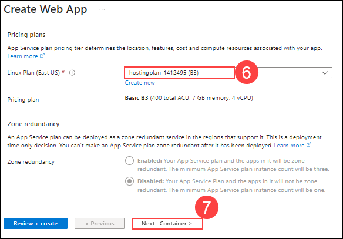
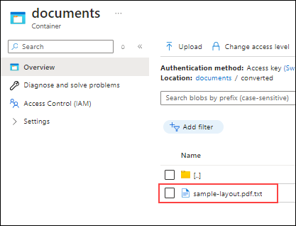
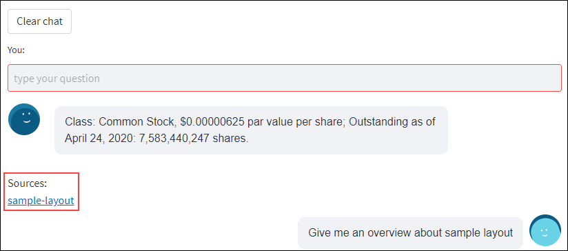
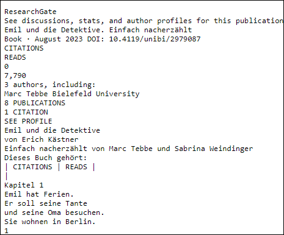

# Exercise 2: Query and retrieval

In this exercise, you will create and deploy a web application from a Docker image in Azure, configure environment variables, and test the deployment.

## Task 1: Create and deploy a web app from a Docker image

In this task, you will create a new Azure Web App resource. The web app will be set up to use a Docker container from a specified image. You will configure the app with settings for subscription, resource group, and Linux plan, and then deploy the Docker image **fruocco/oai-embeddings:latest** to the web app.

1. Click on the **+ Create a resource** button on the top left corner of the Azure Portal.

    .png)

1. In the search box, type **Web app (1)**, select **Web App (2)** from the list of results and click on **Create (3)**.

    .png)

1. On the **Basics** tab of **Create Web App** resource page, enter the following details and click on **Next : Container > (7)** button.
   
    - **Subscription (1)**: Default - Pre-assigned subscription.
    
    - **Resource group (2)**: Select Openai-embedded-<inject key="Deployment ID" enableCopy="false"></inject>
    
    - **Name (3)**: Webapp-<inject key="Deployment ID" enableCopy="false"></inject>
    
    - **Publish (4)**: Choose **Container**
   
    - **Operating System (5)**: Choose **Linux**
   
    - **Region (6)**: Select **<inject key="Region" enableCopy="false" />**

      .png)

    - **Linux Plan (6)**: Select an existing plan i.e. **hostingplan-<inject key="Deployment ID" enableCopy="false"></inject> (B3)**

      

1. On the **Container** tab, enter the following details and click on **Next : Review + create > (4)** button.

   - **Image Source (1)**: Select Docker Hub or other registries

   - **Access Type (2)**: Select Public

   - **Image and tag (3)**: Enter fruocco/oai-embeddings:latest

     

1. On the **Review + submit** tab, review the configuration, and click on **Create** button.

    .png)

1. Once the deployment is complete, click on the **Go to resource** button.
   
    .png)

## Task 2: Add environment Variables and check the docker deployment

In this task, you will configure the necessary environment variables. This involves accessing the environment variables section in the web app settings, editing the values to match those provided in the previous exercise, and saving the changes.

1. In the left-hand menu, select **Environment variables (1)** under **Settings** and Click on **Advanced edit (2)** at the top of the page to view or modify the environment variables.

    .png)

1. In the advanced editor, delete the current values and paste the new values you copied from the Function App in the previous exercise. Then, click **OK**.

    .png)

1. Click on **Apply** and then select **Confirm** to save the changes.

    

    

### Task 3: Test the web app

In this task, you will test the functionality of the deployed web app by browsing it through the Azure Portal

1. Now, go to the **Overview** of the Azure Web App, and click on **Browse (2)** to open the web app.

    .png)

    > **Note**: If you encounter any errors while opening the web app, restart the web app, wait for 2-3 minutes, and then try again.

1. After the cold-start delay while your app's Docker image loads and starts, you'll see a page like the following image:

    .png)

1. In the left-hand menu, select **Add Document (1)** and then click on **Browse files (2)**.

    .png)

1. Navigate to `C:\LabFiles` **(1)**, select **sample-layout (2)** file and click **Open (3)**.

    

1. Once the file is uploaded, you'll see a page like the following image:

    .png)

1. To confirm, in the Azure Portal, type **Storage accounts (1)** in the search box and select **Storage accounts (2)** from the results.

    

1. On the Storage accounts page, select **storage<inject key="Deployment ID" enableCopy="false"></inject>**.

    

1. In the left-hand menu, select **Containers (1)** under **Data storage** section and open the **documents (2)** container.

    

1. Verify that the **sample-layout** file has been added to this container. You should also see a folder named **converted**, which contains the text version of the file processed by the Azure Functions.

    

    

1. Return to the web app page, click on **Chat** and ask a question related to the **sample-layout** file. Below are the questions you can ask:

    ```
    Give me an overview about sample layout
    ```

    

1. You can click on **Sources** to obtain the converted file in text format.

    

    

1. From the JumpVM, open **File Explorer** by selecting its icon on the Windows Taskbar.

    

1. Navigate to `C:\LabFiles` **(1)** and double-click on the `Emil und die Detektive book` **(2)** file to open it.

    

1. Once the file is opened, verify that it is in **German language**. We will then use the web app to translate the file into English and provide the results using OpenAI Chat.

1. Return to the web app page, in the left-hand menu, select **Add Document (1)**, check the box for **Translate document to English (2)** and then click on **Browse files (3)**.

    
    
1. Navigate to `C:\LabFiles` **(1)**, select **Emil und die Detektive book (2)** file and click **Open (3)**.

    

1. Once the file is uploaded, you'll see a page like the following image:

    

1. To confirm, return to the **storage<inject key="Deployment ID" enableCopy="false"></inject>** and open the **documents** container. Verify that the **Emil und die Detektive book** file has been added to this container. You should also see a folder named **converted**, which contains the text version of the file processed by the Azure Functions.

    

    

1. Return to the web app page, click on **Chat** and ask a question related to the **Emil und die Detektive book** file. Below are the questions you can ask:

    ```
    Give me an overview about this book
    ```

    

    ```
    What is the name of the main character in the book?
    ```

    

1. You can click on **Sources** to obtain the converted file in text format.

    

    

## Summary
In this exercise, you have explored the end-to-end process of managing and querying a knowledge base using Azure services. The workflow includes the following key steps:

1. **Knowledge Base Storage**:
   - **Azure Storage**: Stores unstructured documents such as PDFs, DOCX, and TXT files, providing a scalable and secure repository.

2. **Data Extraction**:
   - **Azure Document Intelligence**: Automatically extracts paragraphs and dialogues from the raw documents, converting unstructured data into structured formats for further processing.
   - **Azure Translator (Optional)**: Translates extracted text into the desired language, ensuring the system can handle multilingual queries and documents.

3. **Text Embedding and Indexing**:
   - **Azure OpenAI Service Embeddings**: Converts the extracted text into high-dimensional vectors, encapsulating semantic meaning and context.
   - **Azure AI Search**: Indexes these embeddings, enabling fast and efficient vector-based searches across the knowledge base.

4. **Search and Answering**:
   - **Vector Search**: Uses Azure OpenAI Embeddings to perform a semantic search, matching user queries to the most relevant documents based on vector similarity.
   - **Azure AI Search**: Retrieves the top k relevant paragraphs from the indexed documents.
   - **Azure OpenAI Answering Prompt**: Constructs a concise and contextually accurate response from the retrieved paragraphs. If required, answers can be translated back to the user's preferred language.

### You have successfully completed the lab.
