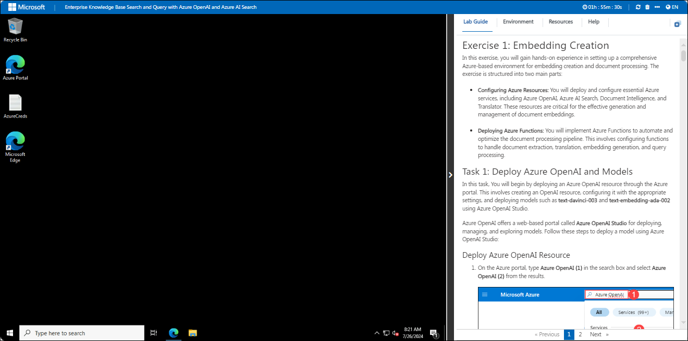
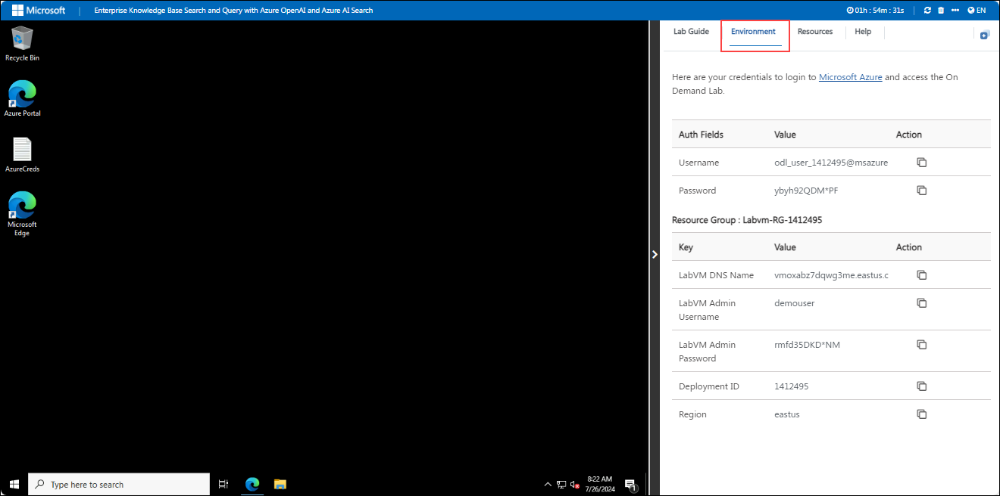
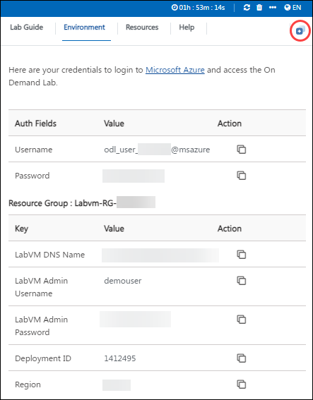

# Enterprise Knowledge Base Search and Query with Azure OpenAI and Azure AI Search

## Overall Estimated Duration: 2 Hours

## Overview 
The purpose of this lab is to explore the capabilities of various Azure services, including Azure OpenAI, Azure AI Search, Document Intelligence, and Translator. These services offer powerful tools for natural language processing, advanced search functionality, document data extraction, and multilingual translation. By integrating these technologies, businesses can automate processes, enhance user experiences, and break down language barriers, leading to increased efficiency and global reach. This lab will provide hands-on experience in leveraging these services to solve real-world challenges.

## Objective

By the end of this lab, you will have:

- **Embedding Creation**: This hands-on exercise will give you practical experience in setting up and configuring Azure services, including Azure OpenAI, Azure AI Search, Document Intelligence, and Translator. You will deploy and manage Azure Functions to automate and optimise tasks such as document extraction, translation, embedding generation, and query handling. Additionally, you will gain a comprehensive understanding of the end-to-end process involved in creating and managing document embeddings within an Azure-based environment.

- **Query and Retrieval**: This hands-on exercise will guide you through creating and deploying a web application using a Docker image in Azure. You will configure the necessary environment variables and test the deployment to ensure the application operates effectively. This will enable you to perform efficient query and retrieval operations within your Azure environment.

## Pre-Requisites
You should have a basic understanding of **Azure services**, including **Azure OpenAI**, **Azure AI Search**, and **Translator**. Experience in deploying **web applications** and **Azure Functions** is also required.

## Architecture

The process involves storing documents in Azure storage accounts, with optional translation and text extraction using a function app. Texts are then converted into embeddings by an Azure OpenAI embedding model and stored in Azure AI Search for efficient retrieval. When a query is submitted, it is vectorized and used to search for relevant content in Azure AI Search. The search results are processed by an Azure OpenAI language model to generate a response. This workflow uses Azure services including storage accounts, function apps, Document Intelligence, embedding models, AI Search, and language models.

## Architecture Diagram

## Explanation of Components

- **Storage Accounts**: These are used to store your documents in Azure. They act as the initial repository where documents are kept before any processing begins.

- **Function App**: A serverless compute service in Azure that automates tasks such as translating documents (if needed) and extracting text from them. It processes the documents and prepares the text for further steps.

- **Azure OpenAI Embedding Model**: Converts the extracted text into embeddings, which are vector representations capturing the semantic meaning of the text. These embeddings are used for efficient content retrieval.

- **Azure AI Search**: Stores the embeddings and enables powerful search capabilities. It allows for fast and accurate retrieval of relevant content based on similarity to a user’s query.

- **Azure OpenAI Language Model**: Utilises the search results from Azure AI Search to generate a response. It applies advanced language processing to create coherent and contextually appropriate answers.

- **Document Intelligence (Form Recognizer)**: Provides capabilities to extract structured information from various types of documents, such as invoices and receipts, which can be used to enrich the data before embedding.

- **Translator**: An optional service that translates text into different languages, making the content accessible to users who speak different languages.

## Accessing Your Lab Environment
 
Once you're ready to dive in, your virtual machine and lab guide will be right at your fingertips within your web browser.
 

### Virtual Machine & Lab Guide
 
Your virtual machine is your workhorse throughout the workshop. The lab guide is your roadmap to success.
 
## Exploring Your Lab Resources
 
To get a better understanding of your lab resources and credentials, navigate to the **Environment** tab.
 

 
## Utilizing the Split Window Feature
 
For convenience, you can open the lab guide in a separate window by selecting the **Split Window** button from the Top right corner.
 

 
## Managing Your Virtual Machine
 
Feel free to start, stop, or restart your virtual machine as needed from the **Resources** tab. Your experience is in your hands!
 

 
## Lab Duration Extension

1. To extend the duration of the lab, kindly click the **Hourglass** icon in the top right corner of the lab environment. 

    

    >**Note:** You will get the **Hourglass** icon when 15 minutes are remaining in the lab.

2. Click **OK** to extend your lab duration.
 
   

3. If you have not extended the duration prior to when the lab is about to end, a pop-up will appear, giving you the option to extend. Click **OK** to proceed.

## Let's Get Started with Azure Portal
 
1. On your virtual machine, click on the Azure Portal icon as shown below:
 
   

2. You'll see the **Sign into Microsoft Azure** tab. Here, enter your credentials:
 
   - **Email/Username:** <inject key="AzureAdUserEmail"></inject>
 
     
 
3. Next, provide your password:
 
   - **Password:** <inject key="AzureAdUserPassword"></inject>
 
     
 
4. If prompted to stay signed in, you can click "**No**".
 
5. If a **Welcome to Microsoft Azure** pop-up window appears, simply click "**Cancel**" to skip the tour.
   
## Support Contact
 
The CloudLabs support team is available 24/7, 365 days a year, via email and live chat to ensure seamless assistance at any time. We offer dedicated support channels tailored specifically for both learners and instructors, ensuring that all your needs are promptly and efficiently addressed.

Learner Support Contacts:
- Email Support: labs-support@spektrasystems.com
- Live Chat Support: https://cloudlabs.ai/labs-support

Now, click on **Next** from the lower right corner to move on to the next page.
 
   

### Happy Learning!!
