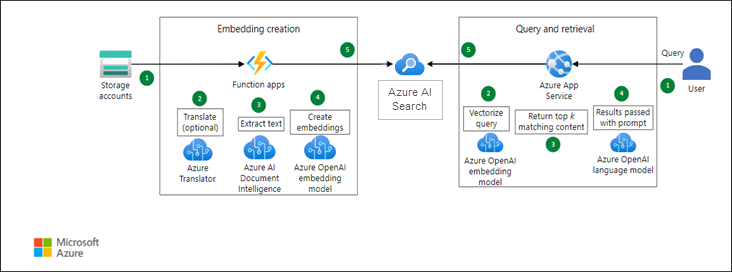

# Enterprise Knowledge Base Search and Query with Azure OpenAI and Azure AI Search

### Overall Estimated Duration: 2 Hours

## Overview 

The purpose of this lab is to explore the capabilities of various Azure services, including Azure OpenAI, Azure AI Search (Formerly known as Cognitive Search), Document Intelligence (Formerly known as Form Recognizer), and Translator. These services offer powerful tools for natural language processing, advanced search functionality, document data extraction, and multilingual translation. By integrating these technologies, businesses can automate processes, enhance user experiences, and break down language barriers, leading to increased efficiency and global reach. This lab will provide hands-on experience in leveraging these services to solve real-world challenges.

## Objective

By the end of this lab, you will have:

- **Embedding Creation**: Develop high-quality embeddings for documents and queries within the enterprise knowledge base to enhance semantic understanding and improve search relevance. This involves leveraging Azure OpenAI to generate contextually rich embeddings that capture the nuances of the information, allowing for more accurate comparisons between user queries and stored knowledge.

- **Query and Retrieval**: Implement an efficient query and retrieval system using Azure AI Search that utilizes the embeddings created to facilitate rapid, accurate responses to user inquiries. The goal is to optimize the search process by enabling semantic search capabilities, ensuring that users can easily find relevant information within the knowledge base, thus improving overall productivity and decision-making.

## Prerequisites

Participants should have:

- **Basic Understanding of Azure Services:** Familiarity with Azure's ecosystem and its core services helps in navigating the platform effectively.
- **Familiarity with Natural Language Processing (NLP) Concepts:** Understanding NLP fundamentals is essential for leveraging language models in AI applications.
- **Experience with APIs:** Knowledge of how to interact with APIs is crucial for integrating Azure OpenAI and Azure AI Search into applications.
- **Knowledge of Search Technologies:** Familiarity with search algorithms and indexing improves the implementation of effective search solutions.
- **Proficiency in Programming Languages (e.g., Python, C#):** Basic programming skills are necessary for developing and customizing applications using Azure services.

## Architecture

The process involves storing documents in Azure storage accounts, with optional translation and text extraction using a function app. Texts are then converted into embeddings by an Azure OpenAI embedding model and stored in Azure AI Search for efficient retrieval. When a query is submitted, it is vectorized and used to search for relevant content in Azure AI Search. The search results are processed by an Azure OpenAI language model to generate a response. This workflow uses Azure services including storage accounts, function apps, Document Intelligence, embedding models, AI Search, and language models.

## Architecture Diagram

## Explanation of Components

The architecture for this lab involves the following key components:

- **Storage Accounts**: These are used to store your documents in Azure. They act as the initial repository where documents are kept before any processing begins.
- **Function App**: A serverless compute service in Azure that automates tasks such as translating documents (if needed) and extracting text from them. It processes the documents and prepares the text for further steps.
- **Azure OpenAI Embedding Model**: Converts the extracted text into embeddings, which are vector representations capturing the semantic meaning of the text. These embeddings are used for efficient content retrieval.
- **Azure AI Search (Cognitive Search)**: Stores the embeddings and enables powerful search capabilities. It allows for fast and accurate retrieval of relevant content based on similarity to a user’s query.
- **Azure OpenAI Language Model**: Utilises the search results from Azure AI Search to generate a response. It applies advanced language processing to create coherent and contextually appropriate answers.
- **Document Intelligence (Form Recognizer)**: Provides capabilities to extract structured information from various types of documents, such as invoices and receipts, which can be used to enrich the data before embedding.
- **Translator**: An optional service that translates text into different languages, making the content accessible to users who speak different languages.

## Accessing Your Lab Environment
 
Once you're ready to dive in, your virtual machine and lab guide will be right at your fingertips within your web browser.
 

### Virtual Machine & Lab Guide
 
Your virtual machine is your workhorse throughout the workshop. The lab guide is your roadmap to success.
 
## Exploring Your Lab Resources
 
To get a better understanding of your lab resources and credentials, navigate to the **Environment** tab.
 

 
## Utilizing the Split Window Feature
 
For convenience, you can open the lab guide in a separate window by selecting the **Split Window** button from the Top right corner.
 

 
## Managing Your Virtual Machine
 
Feel free to start, stop, or restart your virtual machine as needed from the **Resources** tab. Your experience is in your hands!
 

 
## Lab Duration Extension

1. To extend the duration of the lab, kindly click the **Hourglass** icon in the top right corner of the lab environment. 

    

    >**Note:** You will get the **Hourglass** icon when 15 minutes are remaining in the lab.

2. Click **OK** to extend your lab duration.
 
   

3. If you have not extended the duration prior to when the lab is about to end, a pop-up will appear, giving you the option to extend. Click **OK** to proceed.

## Let's Get Started with Azure Portal
 
1. On your virtual machine, click on the Azure Portal icon as shown below:
 
   

2. On the **Sign in to Microsoft Azure** tab you will see the login screen, in that enter the following email/username, and click on **Next**.
 
   - **Email/Username:** <inject key="AzureAdUserEmail"></inject>
 
     
 
3. Now enter the following password and click on **Sign in**.
 
   - **Password:** <inject key="AzureAdUserPassword"></inject>
 
     
 
1. If you see the pop-up Action Required, click Ask Later.

   

   >**NOTE:** Do not enable MFA, select **Ask Later**.
     
1. If you see the pop-up **Stay Signed in?**, select **No**.

1. If you see the pop-up **You have free Azure Advisor recommendations!**, close the window to continue the lab.

1. If a **Welcome to Microsoft Azure** popup window appears, select **Maybe Later** to skip the tou
   
## Support Contact
 
The CloudLabs support team is available 24/7, 365 days a year, via email and live chat to ensure seamless assistance at any time. We offer dedicated support channels tailored specifically for both learners and instructors, ensuring that all your needs are promptly and efficiently addressed.

Learner Support Contacts:
- Email Support: cloudlabs-support@spektrasystems.com
- Live Chat Support: https://cloudlabs.ai/labs-support

Now, click on **Next** from the lower right corner to move on to the next page.
 
   

### Happy Learning!!
