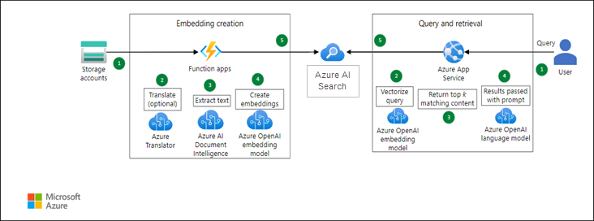

# Overview of Enterprise Knowledge Base Search and Query with Azure OpenAI and Azure AI Search

### Extract Precise Answers from Unstructured Documents

In modern enterprises, the ability to quickly and accurately extract information from vast amounts of unstructured data is vital. Leveraging Azure OpenAI Service, we can build a sophisticated Q&A system that delivers precise answers from your documents, similar to the capabilities of ChatGPT. This solution integrates seamlessly with Azure AI Search and other Azure services to provide a robust and efficient information retrieval system.

### Solution Architecture

### Workflow Breakdown

1. **Knowledge Base Storage**:
   - **Azure Storage**: Stores unstructured documents such as PDFs, DOCX, and TXT files, providing a scalable and secure repository.

2. **Data Extraction**:
   - **Azure Document Intelligence**: Automatically extracts paragraphs and dialogues from the raw documents. This step converts unstructured data into structured formats for further processing.
   - **Azure Translator (Optional)**: Translates extracted text into the desired language, ensuring the system can handle multilingual queries and documents.

3. **Text Embedding and Indexing**:
   - **Azure OpenAI Service Embeddings**: Converts the extracted text into high-dimensional vectors, encapsulating semantic meaning and context.
   - **Azure AI Search**: Indexes these embeddings, enabling fast and efficient vector-based searches across the knowledge base.

4. **Search and Answering**:
   - **Vector Search**: Uses Azure OpenAI Embeddings to perform a semantic search, matching user queries to the most relevant documents based on vector similarity.
   - **Azure AI Search**: Retrieves the top k relevant paragraphs from the indexed documents.
   - **Azure OpenAI Answering Prompt**: Construct a concise and contextually accurate response from the retrieved paragraphs. If required, answers can be translated back to the user's preferred language.

### User Interaction Flow

- **Query Submission**: Users submit questions in natural language. These queries can be translated to the system's processing language if needed.
- **Semantic Search**: The system performs a vector-based search to identify the most relevant information.
- **Answer Extraction**: The top k paragraphs are extracted, and a coherent answer is generated using Azure OpenAI Service.
- **Response Delivery**: The answer is presented to the user, providing precise and actionable information.

### Example Use Case

A user submits the query: "There is a red blinking light on the C4 button in my SP-300a machine, which part do I need to replace?"

- The system processes this query, performing a semantic search over the knowledge base.
- It retrieves relevant paragraphs and formulates the response: "You need to replace parts a & b. Here’s the link to order them."

This example highlights the system's ability to understand complex queries and provide precise, contextually relevant answers.

### Benefits

- **Enhanced Information Retrieval**: Extract precise answers from a vast repository of unstructured documents, improving decision-making and operational efficiency.
- **Scalable and Flexible**: Leverage Azure's scalable storage and processing capabilities to handle growing volumes of data.
- **Multilingual Support**: Optional translation services ensure the system can cater to a global audience, breaking language barriers.

